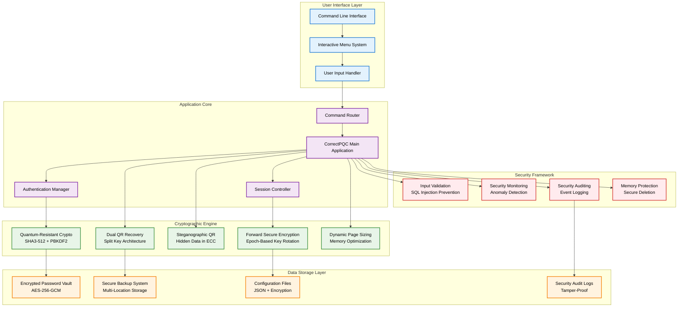
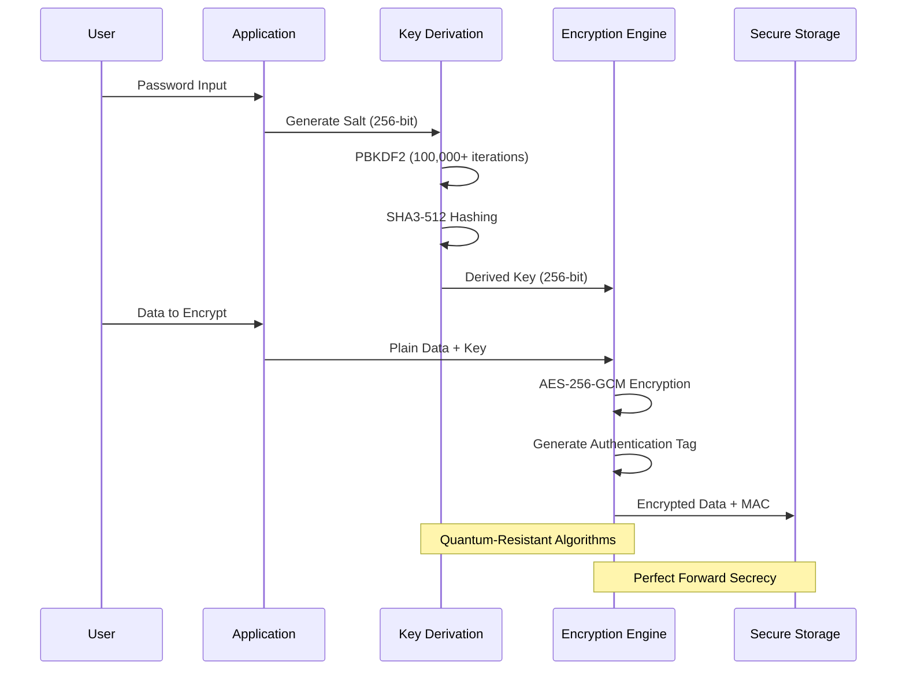
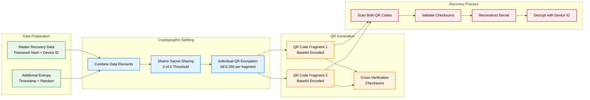
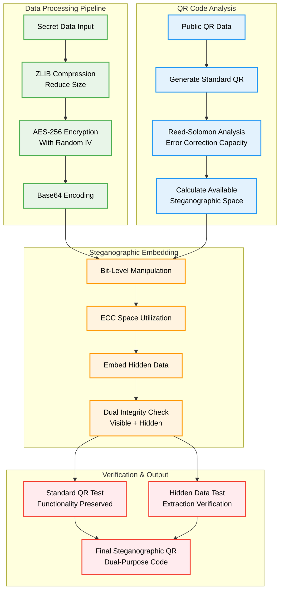
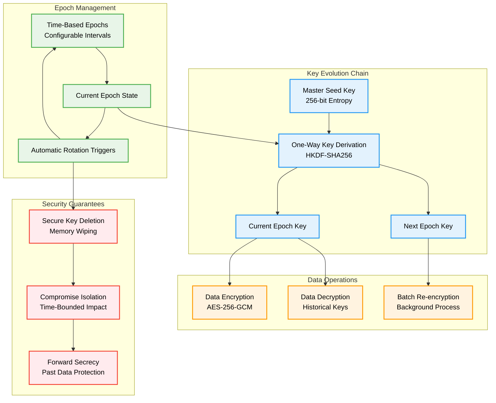
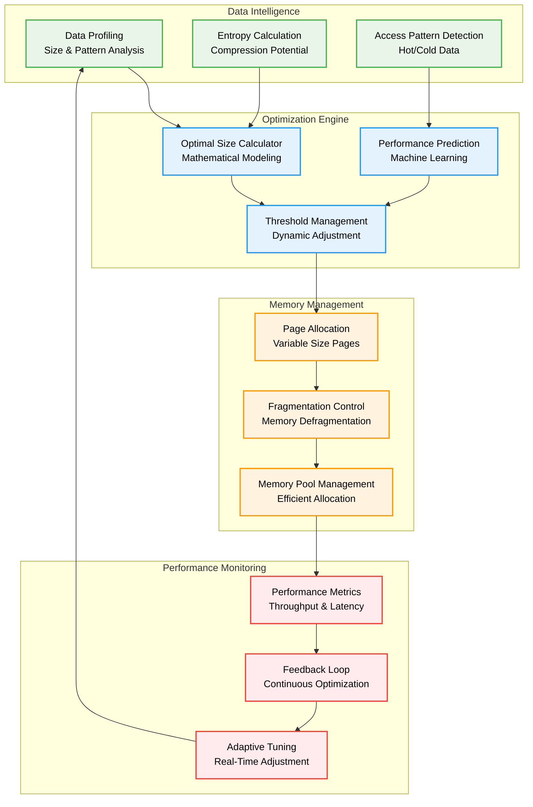

# Post Quantum Offline Manager

A quantum-resistant password manager with advanced cryptographic features designed for the post-quantum era. Built with enterprise-grade security and innovative cryptographic libraries.

## 🔐 Overview

Post Quantum Offline Manager (QuantumVault) is a comprehensive password management solution that implements quantum-resistant cryptography to protect against both classical and quantum computer attacks. The system integrates multiple innovative cryptographic libraries to provide maximum security for sensitive data storage.

## 🏗️ System Architecture



## 🔑 Cryptographic Architecture

### Quantum-Resistant Cryptography Module



### Dual QR Recovery System Architecture



### Steganographic QR System Architecture



### Forward Secure Encryption Architecture



### Dynamic Page Sizing Architecture



## 🚀 Features

### Core Security Features
- **Quantum-Resistant Cryptography**: SHA3-512 hashing with PBKDF2 key derivation
- **AES-256-GCM Encryption**: Authenticated encryption with associated data
- **Device Binding**: Hardware fingerprint integration for device-specific security
- **Secure Memory Management**: Memory protection and secure deletion
- **Timing Attack Protection**: Constant-time operations for cryptographic functions

### Advanced Features
- **Dual QR Recovery System**: Split recovery across two independent QR codes
- **Steganographic QR Codes**: Hidden data embedding in error correction space
- **Forward Secure Encryption**: Epoch-based key rotation with perfect forward secrecy
- **Dynamic Page Sizing**: Adaptive memory optimization for large datasets
- **Comprehensive Auditing**: Security event logging and monitoring

### Data Management
- **Password Storage**: Secure storage of passwords with metadata
- **Import/Export**: CSV and Excel file support for bulk operations
- **Backup Systems**: Multi-location backup with encryption
- **Search Functionality**: Fast and secure password searching
- **Data Validation**: Input sanitization and validation

## 📋 Requirements

### System Requirements
- **Python**: 3.11 or higher
- **Operating System**: Windows, macOS, Linux
- **Memory**: Minimum 512 MB RAM
- **Storage**: 100 MB free space

### Dependencies
```bash
# Core dependencies
pip install cryptography pandas qrcode[pil] hashlib secrets
```

## 🔧 Installation

1. **Clone the repository**:
```bash
git clone https://github.com/Johnsonajibi/Post_Quantum_Offline_Manager.git
cd Post_Quantum_Offline_Manager
```

2. **Install dependencies**:
```bash
pip install -r requirements.txt
```

3. **Run the application**:
```bash
python CorrectPQC.py
```

## 🎯 Usage

### Basic Operations
```bash
# Start the application
python CorrectPQC.py

# Follow the interactive menu to:
# 1. Add new passwords
# 2. Search for passwords
# 3. Generate QR recovery codes
# 4. Import/export data
# 5. Configure security settings
```

### Advanced Features
```bash
# Generate dual QR recovery codes
# Navigate to: Security → QR Recovery → Generate Dual QR

# Create steganographic QR codes
# Navigate to: Advanced → Steganographic QR → Create Hidden QR

# Configure forward secure encryption
# Navigate to: Security → Forward Secure → Configure Epochs
```

## 🛡️ Security

### Cryptographic Standards
- **Hash Function**: SHA3-512 (NIST approved, quantum-resistant)
- **Key Derivation**: PBKDF2 with 100,000+ iterations
- **Encryption**: AES-256-GCM (authenticated encryption)
- **Random Number Generation**: Cryptographically secure PRNG

### Security Measures
- **Input Validation**: Prevents injection attacks
- **Memory Protection**: Secure memory allocation and deletion
- **Audit Logging**: Comprehensive security event logging
- **Device Binding**: Hardware-specific cryptographic binding
- **Forward Secrecy**: Time-bounded compromise isolation

## 📜 License

This project is licensed under the MIT License - see the [LICENSE](LICENSE) file for details.

## 🤝 Contributing

1. Fork the repository
2. Create a feature branch (`git checkout -b feature/amazing-feature`)
3. Commit your changes (`git commit -m 'Add some amazing feature'`)
4. Push to the branch (`git push origin feature/amazing-feature`)
5. Open a Pull Request

## 📞 Support

For support, please open an issue on GitHub or contact the development team.

## 🔮 Future Roadmap

- **GUI Interface**: Desktop application with modern UI
- **Mobile Integration**: iOS and Android companion apps
- **Cloud Sync**: Optional encrypted cloud synchronization
- **Hardware Security Module**: HSM integration for enterprise use
- **Multi-Factor Authentication**: TOTP and hardware token support
