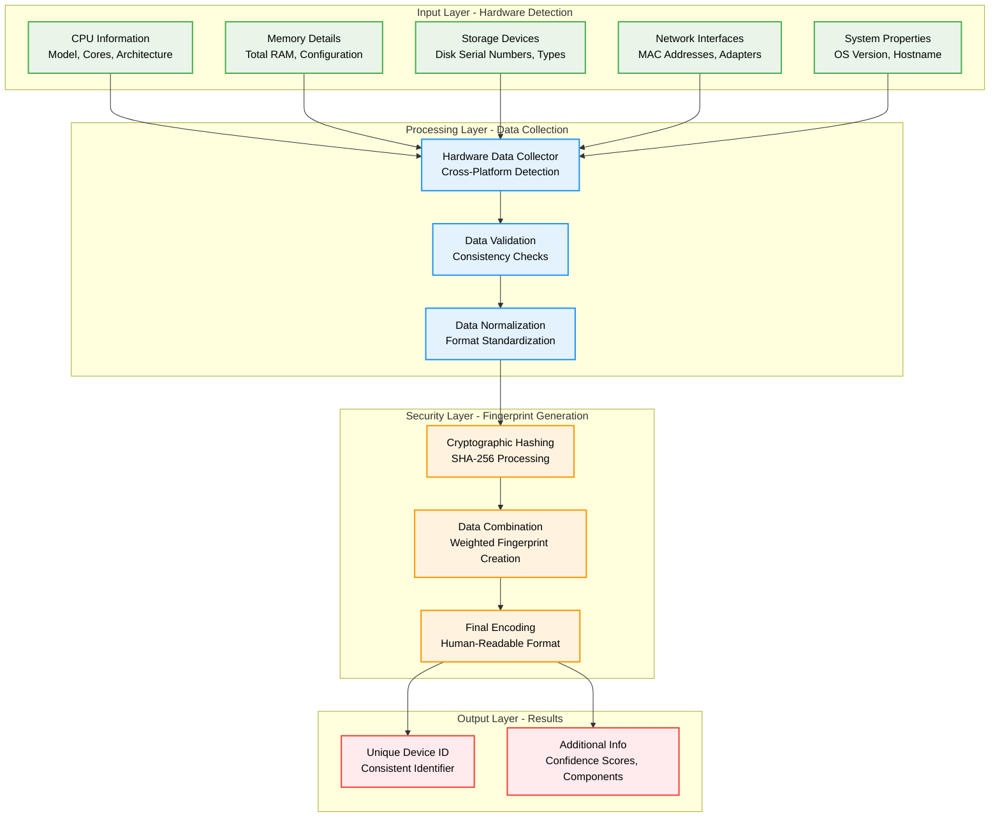
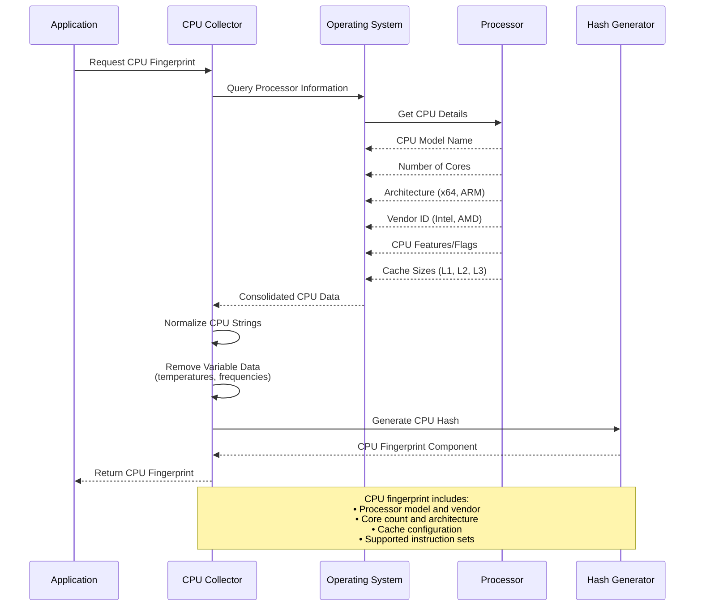
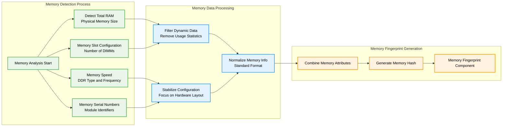
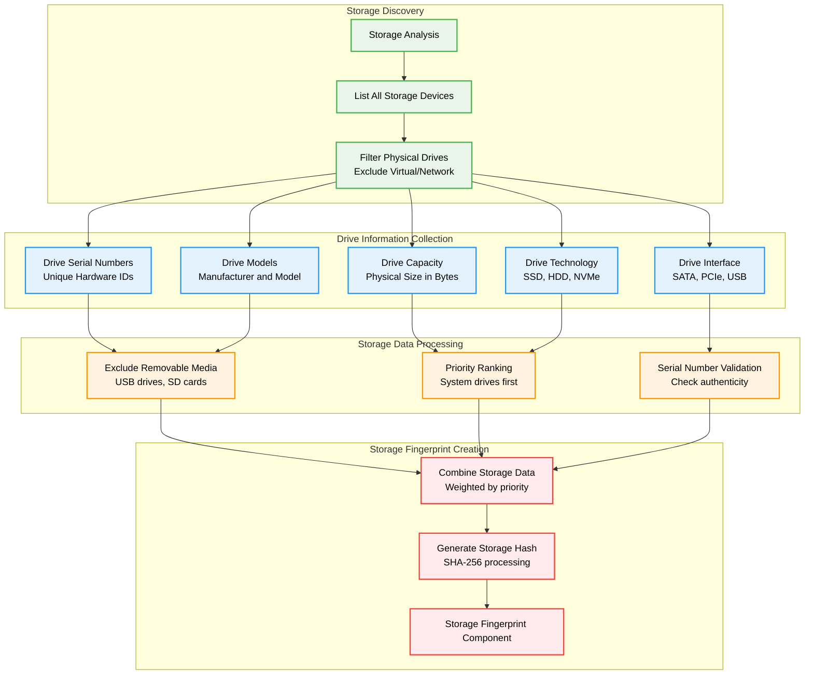
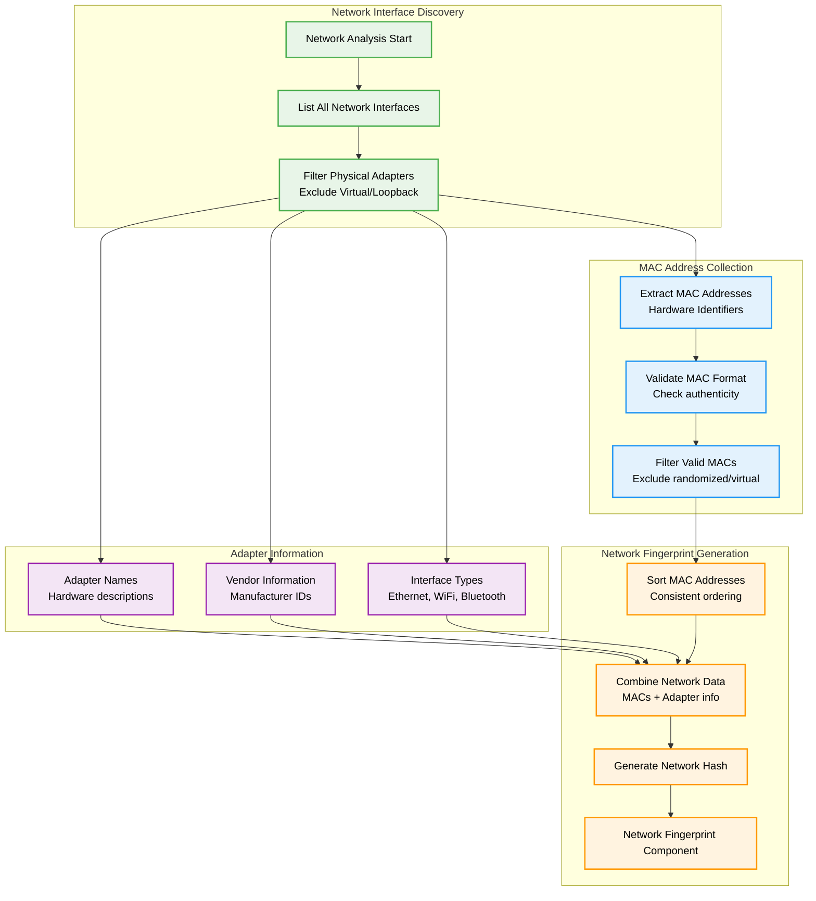
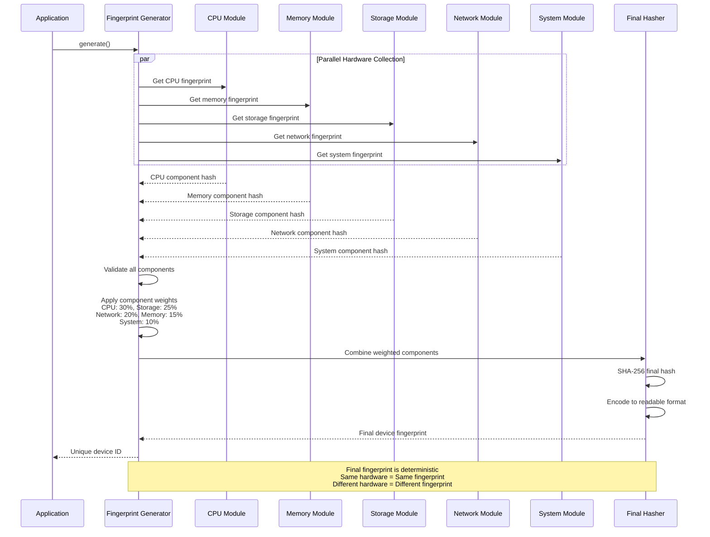

# Device Fingerprinting Library

[](https://pypi.org/project/device-fingerprinting-pro/)
[](https://github.com/Johnsonajibi/DeviceFingerprinting/blob/main/LICENSE)

A comprehensive Python library for generating unique, hardware-based device fingerprints that work consistently across sessions and system changes.

## What This Library Does

Think of this library as a way to create a "digital DNA" for any computer or device. Just like how your fingerprint uniquely identifies you, this library creates a unique identifier for devices based on their hardware characteristics. It's particularly useful for:

- **Security applications** - Detecting when someone tries to access your system from an unknown device
- **License management** - Ensuring software runs only on authorized machines
- **Fraud prevention** - Identifying suspicious login attempts from new devices
- **Analytics** - Tracking unique devices without collecting personal information

## System Architecture Overview

Here's how the device fingerprinting system works at a high level:



## Core Features Deep Dive

### 1. Cross-Platform Hardware Detection

The library automatically detects what type of system it's running on and uses the appropriate methods to gather hardware information:

```mermaid
flowchart TD
    subgraph "Platform Detection"
        Start[Library Initialization]
        Detect[Detect Operating System]
        Windows{Windows?}
        macOS{macOS?}
        Linux{Linux?}
    end
    
    subgraph "Windows Hardware Detection"
        WMI[Windows Management<br/>Instrumentation (WMI)]
        Registry[Windows Registry<br/>Hardware Keys]
        PowerShell[PowerShell Commands<br/>System Information]
    end
    
    subgraph "macOS Hardware Detection"
        SystemProfiler[System Profiler<br/>Hardware Overview]
        IOKit[IOKit Framework<br/>Device Information]
        Sysctl[Sysctl Commands<br/>Kernel Parameters]
    end
    
    subgraph "Linux Hardware Detection"
        ProcFS[/proc filesystem<br/>Hardware Information]
        SysFS[/sys filesystem<br/>Device Properties]
        DMIDecode[dmidecode Tool<br/>DMI/SMBIOS Data]
        LSCommands[lscpu, lsmem, lsblk<br/>Hardware Listing]
    end
    
    subgraph "Unified Data Collection"
        Normalize[Data Normalization]
        Validate[Cross-Platform Validation]
        Combine[Unified Hardware Profile]
    end
    
    Start --> Detect
    Detect --> Windows
    Detect --> macOS
    Detect --> Linux
    
    Windows -->|Yes| WMI
    Windows -->|Yes| Registry
    Windows -->|Yes| PowerShell
    
    macOS -->|Yes| SystemProfiler
    macOS -->|Yes| IOKit
    macOS -->|Yes| Sysctl
    
    Linux -->|Yes| ProcFS
    Linux -->|Yes| SysFS
    Linux -->|Yes| DMIDecode
    Linux -->|Yes| LSCommands
    
    WMI --> Normalize
    Registry --> Normalize
    PowerShell --> Normalize
    SystemProfiler --> Normalize
    IOKit --> Normalize
    Sysctl --> Normalize
    ProcFS --> Normalize
    SysFS --> Normalize
    DMIDecode --> Normalize
    LSCommands --> Normalize
    
    Normalize --> Validate
    Validate --> Combine
    
    classDef detection fill:#e8f5e8,stroke:#4caf50,stroke-width:2px,color:#000000
    classDef windows fill:#e3f2fd,stroke:#2196f3,stroke-width:2px,color:#000000
    classDef macos fill:#f3e5f5,stroke:#9c27b0,stroke-width:2px,color:#000000
    classDef linux fill:#fff3e0,stroke:#ff9800,stroke-width:2px,color:#000000
    classDef unified fill:#ffebee,stroke:#f44336,stroke-width:2px,color:#000000
    
    class Start,Detect,Windows,macOS,Linux detection
    class WMI,Registry,PowerShell windows
    class SystemProfiler,IOKit,Sysctl macos
    class ProcFS,SysFS,DMIDecode,LSCommands linux
    class Normalize,Validate,Combine unified
```

### 2. CPU Fingerprinting Architecture

The CPU fingerprinting system captures detailed processor information that remains consistent across reboots:



### 3. Memory Fingerprinting System

Memory fingerprinting focuses on the physical memory configuration rather than current usage:



### 4. Storage Device Fingerprinting

Storage fingerprinting creates identifiers based on physical storage devices:



### 5. Network Interface Fingerprinting

Network fingerprinting uses permanent hardware identifiers from network adapters:



### 6. Final Fingerprint Assembly Process

This shows how all the individual components are combined into the final device fingerprint:



## Installation and Quick Start

### Installation

```bash
pip install device-fingerprinting-pro
```

Or from source:
```bash
git clone https://github.com/Johnsonajibi/DeviceFingerprinting.git
cd DeviceFingerprinting
pip install -r requirements.txt
```

### Basic Usage

```python
from device_fingerprinting import DeviceFingerprint

# Create a device fingerprint
fingerprint = DeviceFingerprint()
device_id = fingerprint.generate()

print(f"Device ID: {device_id}")
# Output: Device ID: 2a4b8c9d1e2f3a4b5c6d7e8f9a0b1c2d3e4f5a6b
```

### Advanced Usage with Component Details

```python
from device_fingerprinting import DeviceFingerprint

# Create fingerprint with detailed information
fingerprint = DeviceFingerprint()

# Generate with component breakdown
result = fingerprint.generate_detailed()

print(f"Device ID: {result['device_id']}")
print(f"CPU Component: {result['components']['cpu']}")
print(f"Memory Component: {result['components']['memory']}")
print(f"Storage Component: {result['components']['storage']}")
print(f"Network Component: {result['components']['network']}")
print(f"Confidence Score: {result['confidence_score']}")
```

### Device Comparison and Validation

```python
from device_fingerprinting import DeviceFingerprint

fingerprint = DeviceFingerprint()

# Store the device ID for later comparison
stored_device_id = fingerprint.generate()

# Later, verify if this is the same device
current_device_id = fingerprint.generate()

if stored_device_id == current_device_id:
    print("Same device confirmed")
else:
    print("Different device detected")
    
# Check similarity score for partial hardware changes
similarity = fingerprint.compare_devices(stored_device_id, current_device_id)
print(f"Device similarity: {similarity:.2%}")
```

## Security and Privacy Considerations

### What Information is Collected

The library collects only hardware-specific information:

- **CPU**: Model, cores, architecture (no usage data)
- **Memory**: Total capacity, configuration (no content)
- **Storage**: Device serials, models (no file data)
- **Network**: MAC addresses of physical adapters (no traffic)
- **System**: OS type, version (no personal files)

### What Information is NOT Collected

- Personal files or documents
- Network traffic or browsing history
- User accounts or passwords
- Application usage or installed software
- Geographic location
- Any personally identifiable information

### Data Processing

All collected hardware information is:
1. **Hashed immediately** using SHA-256
2. **Combined securely** with weighted algorithms
3. **Stored as hash only** - original data is discarded
4. **Non-reversible** - cannot reconstruct original hardware info

## Use Cases and Examples

### 1. Software License Management

```python
import json
from device_fingerprinting import DeviceFingerprint

class LicenseManager:
    def __init__(self, license_file="license.json"):
        self.license_file = license_file
        self.fingerprint = DeviceFingerprint()
    
    def activate_license(self, license_key):
        """Activate software license for this device"""
        device_id = self.fingerprint.generate()
        
        license_data = {
            "license_key": license_key,
            "device_id": device_id,
            "activation_date": "2025-09-09",
            "status": "active"
        }
        
        with open(self.license_file, 'w') as f:
            json.dump(license_data, f)
        
        return f"License activated for device: {device_id[:16]}..."
    
    def verify_license(self):
        """Verify license is valid for current device"""
        try:
            with open(self.license_file, 'r') as f:
                license_data = json.load(f)
            
            current_device = self.fingerprint.generate()
            licensed_device = license_data["device_id"]
            
            if current_device == licensed_device:
                return True, "License valid for this device"
            else:
                return False, "License not valid for this device"
                
        except FileNotFoundError:
            return False, "No license file found"

# Usage
license_mgr = LicenseManager()
license_mgr.activate_license("ABCD-EFGH-IJKL-MNOP")
is_valid, message = license_mgr.verify_license()
print(message)
```

### 2. Security Access Control

```python
from device_fingerprinting import DeviceFingerprint
import json
from datetime import datetime

class DeviceSecurityManager:
    def __init__(self):
        self.fingerprint = DeviceFingerprint()
        self.known_devices_file = "known_devices.json"
    
    def register_device(self, device_name):
        """Register current device as trusted"""
        device_id = self.fingerprint.generate()
        device_info = self.fingerprint.generate_detailed()
        
        device_record = {
            "device_id": device_id,
            "device_name": device_name,
            "registration_date": datetime.now().isoformat(),
            "last_seen": datetime.now().isoformat(),
            "trust_level": "high",
            "components": device_info["components"]
        }
        
        try:
            with open(self.known_devices_file, 'r') as f:
                known_devices = json.load(f)
        except FileNotFoundError:
            known_devices = {}
        
        known_devices[device_id] = device_record
        
        with open(self.known_devices_file, 'w') as f:
            json.dump(known_devices, f, indent=2)
        
        return device_id
    
    def check_device_authorization(self):
        """Check if current device is authorized"""
        current_device = self.fingerprint.generate()
        
        try:
            with open(self.known_devices_file, 'r') as f:
                known_devices = json.load(f)
            
            if current_device in known_devices:
                # Update last seen
                known_devices[current_device]["last_seen"] = datetime.now().isoformat()
                
                with open(self.known_devices_file, 'w') as f:
                    json.dump(known_devices, f, indent=2)
                
                device_name = known_devices[current_device]["device_name"]
                return True, f"Authorized device: {device_name}"
            else:
                return False, "Unknown device detected - access denied"
                
        except FileNotFoundError:
            return False, "No device registry found"

# Usage
security_mgr = DeviceSecurityManager()

# Register current device
device_id = security_mgr.register_device("John's Laptop")
print(f"Device registered: {device_id[:16]}...")

# Check authorization
is_authorized, message = security_mgr.check_device_authorization()
print(message)
```

### 3. Analytics and Tracking (Privacy-Preserving)

```python
from device_fingerprinting import DeviceFingerprint
from collections import defaultdict
import json
from datetime import datetime

class PrivacyPreservingAnalytics:
    def __init__(self):
        self.fingerprint = DeviceFingerprint()
        self.analytics_file = "usage_analytics.json"
    
    def track_usage_session(self, feature_used):
        """Track feature usage without collecting personal data"""
        device_id = self.fingerprint.generate()
        session_data = {
            "timestamp": datetime.now().isoformat(),
            "feature": feature_used,
            "device_hash": device_id,  # Anonymous device identifier
            "session_id": f"session_{datetime.now().strftime('%Y%m%d_%H%M%S')}"
        }
        
        try:
            with open(self.analytics_file, 'r') as f:
                analytics_data = json.load(f)
        except FileNotFoundError:
            analytics_data = {"sessions": []}
        
        analytics_data["sessions"].append(session_data)
        
        with open(self.analytics_file, 'w') as f:
            json.dump(analytics_data, f, indent=2)
    
    def get_unique_devices_count(self):
        """Get count of unique devices (privacy-preserving)"""
        try:
            with open(self.analytics_file, 'r') as f:
                analytics_data = json.load(f)
            
            unique_devices = set()
            for session in analytics_data["sessions"]:
                unique_devices.add(session["device_hash"])
            
            return len(unique_devices)
        except FileNotFoundError:
            return 0
    
    def get_feature_usage_by_device(self):
        """Get feature usage statistics by unique devices"""
        try:
            with open(self.analytics_file, 'r') as f:
                analytics_data = json.load(f)
            
            device_features = defaultdict(set)
            for session in analytics_data["sessions"]:
                device_hash = session["device_hash"]
                feature = session["feature"]
                device_features[device_hash].add(feature)
            
            # Return anonymous statistics
            stats = {
                "total_unique_devices": len(device_features),
                "features_per_device": [len(features) for features in device_features.values()],
                "average_features_per_device": sum(len(f) for f in device_features.values()) / len(device_features) if device_features else 0
            }
            
            return stats
        except FileNotFoundError:
            return {"total_unique_devices": 0}

# Usage
analytics = PrivacyPreservingAnalytics()

# Track some usage
analytics.track_usage_session("file_upload")
analytics.track_usage_session("data_export")
analytics.track_usage_session("report_generation")

# Get privacy-preserving statistics
unique_count = analytics.get_unique_devices_count()
print(f"Total unique devices: {unique_count}")

usage_stats = analytics.get_feature_usage_by_device()
print(f"Average features per device: {usage_stats['average_features_per_device']:.1f}")
```

## Technical Specifications

### Hardware Detection Methods by Platform

| Component | Windows | macOS | Linux |
|-----------|---------|-------|-------|
| CPU | WMI, Registry | sysctl, system_profiler | /proc/cpuinfo, lscpu |
| Memory | WMI, GetPhysicallyInstalledSystemMemory | sysctl, system_profiler | /proc/meminfo, dmidecode |
| Storage | WMI, diskpart | diskutil, system_profiler | lsblk, /proc/partitions |
| Network | WMI, ipconfig | ifconfig, system_profiler | ip addr, /sys/class/net |
| System | Registry, WMI | sw_vers, uname | /etc/os-release, uname |

### Fingerprint Composition Weights

The final device fingerprint uses weighted components to ensure stability:

- **CPU Information**: 30% (highly stable)
- **Storage Devices**: 25% (moderately stable)
- **Network Interfaces**: 20% (stable for built-in adapters)
- **Memory Configuration**: 15% (changes with upgrades)
- **System Information**: 10% (may change with OS updates)

### Stability Across System Changes

| Change Type | Fingerprint Impact | Notes |
|-------------|-------------------|-------|
| Software installation | No change | Only hardware is fingerprinted |
| OS updates | Minimal change | System component weight is low |
| Driver updates | No change | Hardware IDs remain same |
| RAM upgrade | Moderate change | Memory component affected |
| Storage addition | Moderate change | New storage device detected |
| Network card replacement | Moderate change | Network component affected |
| CPU/Motherboard replacement | Major change | New device fingerprint |

## Requirements

- **Python**: 3.7 or higher
- **Dependencies**:
  - `psutil` - Cross-platform system information
  - `hashlib` - Cryptographic hashing (built-in)
  - `json` - Data serialization (built-in)
  - `platform` - Platform detection (built-in)

## License

This project is licensed under the MIT License - see the [LICENSE](LICENSE) file for details.

## Contributing

We welcome contributions! Here's how you can help:

1. **Fork the repository**
2. **Create a feature branch** (`git checkout -b feature/new-feature`)
3. **Add tests** for your changes
4. **Commit your changes** (`git commit -m 'Add new feature'`)
5. **Push to the branch** (`git push origin feature/new-feature`)
6. **Open a Pull Request**

### Development Setup

```bash
# Clone the repository
git clone https://github.com/Johnsonajibi/DeviceFingerprinting.git
cd DeviceFingerprinting

# Create virtual environment
python -m venv venv
source venv/bin/activate  # On Windows: venv\Scripts\activate

# Install development dependencies
pip install -r requirements-dev.txt

# Run tests
python -m pytest tests/

# Run with coverage
python -m pytest --cov=device_fingerprinting tests/
```

## Support and Documentation

- **GitHub Issues**: [Report bugs or request features](https://github.com/Johnsonajibi/DeviceFingerprinting/issues)
- **Documentation**: This README contains comprehensive usage examples
- **Email Support**: Open an issue for technical support

## Changelog

### Version 1.0.0
- Initial release with cross-platform device fingerprinting
- Support for Windows, macOS, and Linux
- CPU, memory, storage, network, and system fingerprinting
- Weighted fingerprint composition for stability
- Privacy-preserving design with immediate hashing