# Post Quantum Offline Manager

A quantum-resistant password manager with advanced cryptographic features designed for the post-quantum era. Built with enterprise-grade security and innovative cryptographic libraries.

## 🔐 Overview

Post Quantum Offline Manager (QuantumVault) is a comprehensive password management solution that implements quantum-resistant cryptography to protect against both classical and quantum computer attacks. The system integrates multiple innovative cryptographic libraries to provide maximum security for sensitive data storage.

## 🏗️ System Architecture

```mermaid
graph TD
    User[� User] --> CLI[� Command Line Interface]
    CLI --> Core[🧠 Core Application]
    
    Core --> Auth[🔐 Authentication]
    Core --> PWM[🔑 Password Manager]
    Core --> Crypto[�️ Cryptography Engine]
    
    Crypto --> QRC[Quantum-Resistant Crypto]
    Crypto --> DQR[Dual QR Recovery]
    Crypto --> SQR[Steganographic QR]
    Crypto --> FSE[Forward Secure Encryption]
    
    PWM --> Storage[💾 Encrypted Storage]
    Storage --> Vault[🗄️ Password Vault]
    Storage --> Backup[💾 Secure Backups]
    Storage --> Logs[📜 Audit Logs]
    
    Core --> Security[🛡️ Security Layer]
    Security --> Monitor[📊 Monitoring]
    Security --> Validate[✅ Validation]
    Security --> Audit[🔍 Auditing]
    
    style User fill:#e1f5fe
    style CLI fill:#f3e5f5
    style Core fill:#e8f5e8
    style Crypto fill:#fff3e0
    style Storage fill:#fce4ec
    style Security fill:#ffebee
```


    classDef securityStyle fill:#ffebee,stroke:#d32f2f,stroke-width:2px,color:#000
    
    class CLI,Menu,Input uiStyle
    class App,Auth,Session,Router coreStyle
    class QRC,DQR,SQR,FSE,DPS cryptoStyle
    class Vault,Token,Backup,Config,Logs storageStyle
    class Audit,Logger,Validator,Monitor securityStyle
```

## 🔑 Cryptographic Architecture

### Quantum-Resistant Cryptography Module

```mermaid
graph LR
    Input[ Password Input] --> Salt[🧂 Salt Generation]
    Salt --> PBKDF2[🔄 PBKDF2 Key Derivation]
    PBKDF2 --> SHA3[🛡️ SHA3-512 Hashing]
    SHA3 --> Key[🗝️ 256-bit Key]
    
    Data[� Data] --> AES[� AES-256-GCM]
    Key --> AES
    AES --> Encrypted[� Encrypted Data]
    AES --> MAC[🔏 Authentication Tag]
    
    style Input fill:#e3f2fd
    style Salt fill:#f3e5f5
    style PBKDF2 fill:#e8f5e8
    style SHA3 fill:#fff3e0
    style Key fill:#fce4ec
    style Data fill:#ffebee
    style AES fill:#e0f2f1
    style Encrypted fill:#f1f8e9
    style MAC fill:#fff8e1
```


    AES --> Metadata
    
    %% Security Properties
    subgraph Properties ["🛡️ Security Properties"]
        Quantum[⚛️ Quantum<br/>Resistant]
        Forward[⏭️ Forward<br/>Secure]
        Timing[⏱️ Timing Attack<br/>Protection]
    end
    
    SHA3 -.-> Quantum
    KeyMat -.-> Forward
    PBKDF2 -.-> Timing
    
    %% Styling
    classDef inputStyle fill:#e8f5e8,stroke:#4caf50,stroke-width:2px,color:#000
    classDef kdfStyle fill:#e3f2fd,stroke:#2196f3,stroke-width:2px,color:#000
    classDef encryptStyle fill:#fff3e0,stroke:#ff9800,stroke-width:2px,color:#000
    classDef outputStyle fill:#f3e5f5,stroke:#9c27b0,stroke-width:2px,color:#000
    classDef propStyle fill:#ffebee,stroke:#f44336,stroke-width:2px,color:#000
    
    class PWD,Salt,Data inputStyle
    class PBKDF2,SHA3,KeyMat kdfStyle
    class AES,AEAD,IV encryptStyle
    class Cipher,MAC,Metadata outputStyle
    class Quantum,Forward,Timing propStyle
```

### Dual QR Recovery System Architecture

```mermaid
graph TD
    Master[� Master Password] --> Split[🔀 Split Recovery Data]
    Device[📱 Device ID] --> Split
    
    Split --> QR1[� QR Code 1]
    Split --> QR2[📱 QR Code 2]
    
    QR1 --> Storage1[� Secure Storage 1]
    QR2 --> Storage2[💾 Secure Storage 2]
    
    Storage1 --> Scan1[📷 Scan QR 1]
    Storage2 --> Scan2[� Scan QR 2]
    
    Scan1 --> Combine[🔗 Combine Data]
    Scan2 --> Combine
    
    Combine --> Verify[✅ Device Verification]
    Verify --> Recover[🔓 Password Recovery]
    
    style Master fill:#e3f2fd
    style Device fill:#f3e5f5
    style Split fill:#e8f5e8
    style QR1 fill:#fff3e0
    style QR2 fill:#fce4ec
    style Combine fill:#ffebee
    style Verify fill:#e0f2f1
    style Recover fill:#f1f8e9
```



### Steganographic QR System Architecture

```mermaid
graph LR
    Secret[🔐 Secret Data] --> Compress[🗜️ Compress]
    Compress --> Encrypt[🔒 Encrypt]
    
    Public[�️ Public QR Data] --> Generate[📱 Generate QR]
    Generate --> Analysis[📊 Error Correction Analysis]
    
    Encrypt --> Embed[🎯 Embed in ECC Space]
    Analysis --> Embed
    
    Embed --> Final[📱 Final QR Code]
    Final --> Verify[✅ Dual Verification]
    
    style Secret fill:#e3f2fd
    style Compress fill:#f3e5f5
    style Encrypt fill:#e8f5e8
    style Public fill:#fff3e0
    style Generate fill:#fce4ec
    style Analysis fill:#ffebee
    style Embed fill:#e0f2f1
    style Final fill:#f1f8e9
    style Verify fill:#fff8e1
```


    
    subgraph Output ["📤 Final Output"]
        StandardFunc[📱 Standard QR<br/>Functionality]
        HiddenLayer[🫥 Hidden Data<br/>Layer]
        CombinedQR[📱 Combined QR Code<br/>Dual Function]
        MetaData[📋 Steganographic<br/>Metadata]
    end
    
    %% Data Preparation Flow
    Secret --> Compress
    Compress --> Encrypt
    Encrypt --> Format
    
    %% QR Generation Flow
    Format --> Visible
    Visible --> ErrorCalc
    ErrorCalc --> ReedSolomon
    ReedSolomon --> Capacity
    
    %% Steganographic Embedding
    Capacity --> BitAnalysis
    BitAnalysis --> ECCManip
    ECCManip --> HiddenEmbed
    HiddenEmbed --> IntegrityCheck
    
    %% Verification Process
    IntegrityCheck --> QRIntegrity
    QRIntegrity --> HiddenIntegrity
    HiddenIntegrity --> CrossValidation
    CrossValidation --> ErrorTolerance
    
    %% Output Generation
    Visible --> StandardFunc
    HiddenEmbed --> HiddenLayer
    StandardFunc --> CombinedQR
    HiddenLayer --> CombinedQR
    IntegrityCheck --> MetaData
    
    %% Innovation Highlights
    subgraph Innovation ["💡 Patent-Pending Innovations"]
        ECC[🧮 Reed-Solomon<br/>Steganography]
        DoubleCapacity[📈 ~2x Storage<br/>Capacity]
        Invisible[👻 Completely<br/>Invisible]
        Backward[↩️ Backward<br/>Compatible]
    end
    
    ECCManip -.-> ECC
    HiddenEmbed -.-> DoubleCapacity
    StandardFunc -.-> Backward
    HiddenLayer -.-> Invisible
    
    %% Styling
    classDef prepStyle fill:#e8f5e8,stroke:#4caf50,stroke-width:2px,color:#000
    classDef qrStyle fill:#e3f2fd,stroke:#2196f3,stroke-width:2px,color:#000
    classDef stegoStyle fill:#fff3e0,stroke:#ff9800,stroke-width:2px,color:#000
    classDef verifyStyle fill:#ffebee,stroke:#f44336,stroke-width:2px,color:#000
    classDef outputStyle fill:#f3e5f5,stroke:#9c27b0,stroke-width:2px,color:#000
    classDef innovStyle fill:#fce4ec,stroke:#e91e63,stroke-width:2px,color:#000
    
    class Secret,Compress,Encrypt,Format prepStyle
    class Visible,ErrorCalc,ReedSolomon,Capacity qrStyle
    class BitAnalysis,ECCManip,HiddenEmbed,IntegrityCheck stegoStyle
    class QRIntegrity,HiddenIntegrity,CrossValidation,ErrorTolerance verifyStyle
    class StandardFunc,HiddenLayer,CombinedQR,MetaData outputStyle
    class ECC,DoubleCapacity,Invisible,Backward innovStyle
```

### Forward Secure Encryption Architecture

```mermaid
graph TD
    Time[⏰ Time Epochs] --> Generate[🔑 Generate Keys]
    Generate --> Encrypt[� Encrypt Data]
    Encrypt --> Store[� Store Encrypted]
    
    Generate --> Delete[🗑️ Delete Old Keys]
    Time --> Rotate[� Key Rotation]
    Rotate --> Generate
    
    Delete --> Forward[⏭️ Forward Security]
    Store --> Backup[� Secure Backup]
    
    style Time fill:#e3f2fd
    style Generate fill:#f3e5f5
    style Encrypt fill:#e8f5e8
    style Store fill:#fff3e0
    style Delete fill:#fce4ec
    style Rotate fill:#ffebee
    style Forward fill:#e0f2f1
    style Backup fill:#f1f8e9
```


    
    subgraph PerfOptim ["⚡ Performance Optimization"]
        MemoryMgmt[🧠 Smart Memory<br/>Management]
        CacheStrategy[💾 Intelligent<br/>Caching]
        LoadBalancing[⚖️ Load<br/>Balancing]
        ProgressTracking[📊 Progress<br/>Tracking]
    end
    
    %% Epoch Management Flow
    CurrentEpoch --> AutoRotation
    AutoRotation --> TimeBasedKeys
    TimeBasedKeys --> EpochTrigger
    EpochTrigger --> CurrentEpoch
    
    %% Key Evolution Flow
    MasterSeed --> OneWayKDF
    TimeBasedKeys --> OneWayKDF
    OneWayKDF --> EpochKeys
    EpochKeys --> SecureDeletion
    
    %% Data Processing Flow
    EpochKeys --> PageData
    PageData --> BatchReEncrypt
    BatchReEncrypt --> IncrementalUpdate
    IncrementalUpdate --> ConcurrentOps
    
    %% Forward Security Implementation
    SecureDeletion --> PastKeysGone
    OneWayKDF --> FutureUnknown
    PastKeysGone --> CompromiseLimit
    FutureUnknown --> CompromiseLimit
    AutoRotation --> TimelineProtection
    
    %% Performance Integration
    BatchReEncrypt --> MemoryMgmt
    IncrementalUpdate --> CacheStrategy
    ConcurrentOps --> LoadBalancing
    PageData --> ProgressTracking
    
    %% Cross-System Integration
    subgraph Integration ["🔗 System Integration"]
        VaultIntegration[🗄️ Vault<br/>Integration]
        BackupSync[💾 Backup<br/>Synchronization]
        AuditTrail[📜 Audit<br/>Trail]
        MonitoringHooks[📊 Monitoring<br/>Hooks]
    end
    
    PageData --> VaultIntegration
    BatchReEncrypt --> BackupSync
    EpochKeys --> AuditTrail
    ProgressTracking --> MonitoringHooks
    
    %% Security Properties
    subgraph Properties ["🔒 Security Properties"]
        PerfectFS[✨ Perfect Forward<br/>Secrecy]
        NonRepudiation[📝 Non-Repudiation<br/>of Past Data]
        QuantumResistant[⚛️ Quantum<br/>Resistant]
        ScalableDesign[📈 Scalable<br/>Design]
    end
    
    CompromiseLimit -.-> PerfectFS
    TimelineProtection -.-> NonRepudiation
    OneWayKDF -.-> QuantumResistant
    ConcurrentOps -.-> ScalableDesign
    
    %% Styling
    classDef epochStyle fill:#e8f5e8,stroke:#4caf50,stroke-width:3px,color:#000
    classDef keyStyle fill:#e3f2fd,stroke:#2196f3,stroke-width:3px,color:#000
    classDef dataStyle fill:#fff3e0,stroke:#ff9800,stroke-width:3px,color:#000
    classDef secStyle fill:#ffebee,stroke:#f44336,stroke-width:3px,color:#000
    classDef perfStyle fill:#f3e5f5,stroke:#9c27b0,stroke-width:3px,color:#000
    classDef integStyle fill:#fce4ec,stroke:#e91e63,stroke-width:2px,color:#000
    classDef propStyle fill:#e0f2f1,stroke:#00695c,stroke-width:2px,color:#000
    
    class CurrentEpoch,AutoRotation,TimeBasedKeys,EpochTrigger epochStyle
    class MasterSeed,OneWayKDF,EpochKeys,SecureDeletion keyStyle
    class PageData,BatchReEncrypt,IncrementalUpdate,ConcurrentOps dataStyle
    class PastKeysGone,FutureUnknown,CompromiseLimit,TimelineProtection secStyle
    class MemoryMgmt,CacheStrategy,LoadBalancing,ProgressTracking perfStyle
    class VaultIntegration,BackupSync,AuditTrail,MonitoringHooks integStyle
    class PerfectFS,NonRepudiation,QuantumResistant,ScalableDesign propStyle
```

### Dynamic Page Sizing Architecture

```mermaid
graph TD
    Data[� Data Analysis] --> Calculate[� Calculate Optimal Size]
    Calculate --> Allocate[🏗️ Allocate Memory Pages]
    Allocate --> Monitor[� Monitor Performance]
    
    Monitor --> Adjust[⚡ Adjust Size]
    Adjust --> Calculate
    
    Allocate --> Store[� Store Data]
    Store --> Optimize[� Optimize Storage]
    
    style Data fill:#e3f2fd
    style Calculate fill:#f3e5f5
    style Allocate fill:#e8f5e8
    style Monitor fill:#fff3e0
    style Adjust fill:#fce4ec
    style Store fill:#ffebee
    style Optimize fill:#e0f2f1
```


    
    subgraph PerfMonitor ["⚡ Performance Monitoring"]
        ThroughputMeter[📊 Throughput<br/>Meter]
        LatencyTracker[⏱️ Latency<br/>Tracker]
        MemoryProfiler[🧠 Memory<br/>Profiler]
        IOOptimizer[💾 I/O<br/>Optimizer]
    end
    
    subgraph MachineLearning ["🤖 Machine Learning Core"]
        UsagePredictor[🔮 Usage<br/>Predictor]
        PatternLearner[📚 Pattern<br/>Learner]
        OptimizationAI[🧠 Optimization<br/>AI]
        FeedbackLoop[🔄 Feedback<br/>Loop]
    end
    
    %% Data Intelligence Flow
    DataProfiler --> PatternRecog
    PatternRecog --> CompressionAnalysis
    CompressionAnalysis --> EntropyScan
    EntropyScan --> DataProfiler
    
    %% Size Optimization Flow
    PatternRecog --> OptimalSize
    OptimalSize --> ThresholdMgmt
    ThresholdMgmt --> SizePredictor
    SizePredictor --> EfficiencyMetrics
    
    %% Adaptive Logic Flow
    OptimalSize --> RealTimeAdjust
    RealTimeAdjust --> LoadBalancer
    LoadBalancer --> ResourceMonitor
    ResourceMonitor --> PerformanceOracle
    
    %% Page Management Flow
    RealTimeAdjust --> PageAllocator
    PageAllocator --> FragmentationCtrl
    FragmentationCtrl --> MemoryPool
    MemoryPool --> GarbageCollector
    
    %% Performance Monitoring Flow
    PageAllocator --> ThroughputMeter
    FragmentationCtrl --> LatencyTracker
    MemoryPool --> MemoryProfiler
    GarbageCollector --> IOOptimizer
    
    %% Machine Learning Integration
    ThroughputMeter --> UsagePredictor
    LatencyTracker --> PatternLearner
    MemoryProfiler --> OptimizationAI
    IOOptimizer --> FeedbackLoop
    FeedbackLoop --> DataProfiler
    
    %% Cross-System Feedback
    subgraph FeedbackSys ["🔄 Feedback System"]
        PerformanceFeedback[📊 Performance<br/>Feedback]
        UserBehavior[👤 User Behavior<br/>Analysis]
        SystemHealth[🏥 System Health<br/>Monitoring]
        PredictiveAdjust[🔮 Predictive<br/>Adjustments]
    end
    
    PerformanceOracle --> PerformanceFeedback
    UsagePredictor --> UserBehavior
    MemoryProfiler --> SystemHealth
    OptimizationAI --> PredictiveAdjust
    
    %% Optimization Outputs
    subgraph Outputs ["🎯 Optimization Outputs"]
        OptimalPageSize[📏 Optimal Page<br/>Size (Dynamic)]
        MemoryEfficiency[🧠 Memory<br/>Efficiency 95%+]
        IOThroughput[💾 I/O Throughput<br/>Maximized]
        LatencyMinimized[⚡ Latency<br/>Minimized]
    end
    
    ThresholdMgmt --> OptimalPageSize
    MemoryPool --> MemoryEfficiency
    IOOptimizer --> IOThroughput
    LatencyTracker --> LatencyMinimized
    
    %% Advanced Features
    subgraph AdvancedFeatures ["🚀 Advanced Features"]
        PredictivePaging[🔮 Predictive<br/>Paging]
        AdaptiveCompression[📦 Adaptive<br/>Compression]
        IntelligentCaching[🧠 Intelligent<br/>Caching]
        QuantumOptimization[⚛️ Quantum-Ready<br/>Optimization]
    end
    
    PatternLearner -.-> PredictivePaging
    CompressionAnalysis -.-> AdaptiveCompression
    UsagePredictor -.-> IntelligentCaching
    OptimizationAI -.-> QuantumOptimization
    
    %% Styling
    classDef dataStyle fill:#e8f5e8,stroke:#4caf50,stroke-width:3px,color:#000
    classDef sizeStyle fill:#e3f2fd,stroke:#2196f3,stroke-width:3px,color:#000
    classDef adaptiveStyle fill:#fff3e0,stroke:#ff9800,stroke-width:3px,color:#000
    classDef pageStyle fill:#ffebee,stroke:#f44336,stroke-width:3px,color:#000
    classDef perfStyle fill:#f3e5f5,stroke:#9c27b0,stroke-width:3px,color:#000
    classDef mlStyle fill:#fce4ec,stroke:#e91e63,stroke-width:3px,color:#000
    classDef feedbackStyle fill:#e0f2f1,stroke:#00695c,stroke-width:2px,color:#000
    classDef outputStyle fill:#fff8e1,stroke:#f57c00,stroke-width:2px,color:#000
    classDef advStyle fill:#f1f8e9,stroke:#558b2f,stroke-width:2px,color:#000
    
    class DataProfiler,PatternRecog,CompressionAnalysis,EntropyScan dataStyle
    class OptimalSize,ThresholdMgmt,SizePredictor,EfficiencyMetrics sizeStyle
    class RealTimeAdjust,LoadBalancer,ResourceMonitor,PerformanceOracle adaptiveStyle
    class PageAllocator,FragmentationCtrl,MemoryPool,GarbageCollector pageStyle
    class ThroughputMeter,LatencyTracker,MemoryProfiler,IOOptimizer perfStyle
    class UsagePredictor,PatternLearner,OptimizationAI,FeedbackLoop mlStyle
    class PerformanceFeedback,UserBehavior,SystemHealth,PredictiveAdjust feedbackStyle
    class OptimalPageSize,MemoryEfficiency,IOThroughput,LatencyMinimized outputStyle
    class PredictivePaging,AdaptiveCompression,IntelligentCaching,QuantumOptimization advStyle
```

## 🚀 Features

### Core Security Features
- **Quantum-Resistant Cryptography**: SHA3-512 hashing with PBKDF2 key derivation
- **AES-256-GCM Encryption**: Authenticated encryption with associated data
- **Device Binding**: Hardware fingerprint integration for device-specific security
- **Secure Memory Management**: Memory protection and secure deletion
- **Timing Attack Protection**: Constant-time operations for cryptographic functions

### Advanced Features
- **Dual QR Recovery System**: Split recovery across two independent QR codes
- **Steganographic QR Codes**: Hidden data embedding in error correction space
- **Forward Secure Encryption**: Epoch-based key rotation with perfect forward secrecy
- **Dynamic Page Sizing**: Adaptive memory optimization for large datasets
- **Comprehensive Auditing**: Security event logging and monitoring

### Data Management
- **Password Storage**: Secure storage of passwords with metadata
- **Import/Export**: CSV and Excel file support for bulk operations
- **Backup Systems**: Multi-location backup with encryption
- **Search Functionality**: Fast and secure password searching
- **Data Validation**: Input sanitization and validation

## 📋 Requirements

### System Requirements
- **Python**: 3.11 or higher
- **Operating System**: Windows, macOS, Linux
- **Memory**: Minimum 512 MB RAM
- **Storage**: 100 MB free space

### Dependencies
```bash
# Core dependencies
cryptography>=41.0.0
pandas>=2.0.0

# Optional QR code support
qrcode[pil]>=7.4.0
Pillow>=10.0.0

# Development dependencies (optional)
pytest>=7.0.0
pytest-cov>=4.0.0
```

## ⚡ Quick Start

### Installation

1. **Clone the repository**:
```bash
git clone https://github.com/Johnsonajibi/Post_Quantum_Offline_Manager.git
cd Post_Quantum_Offline_Manager
```

2. **Install dependencies**:
```bash
pip install cryptography pandas qrcode[pil] Pillow
```

3. **Run the application**:
```bash
python CorrectPQC.py
```

### First-Time Setup

1. **Choose token storage location** (USB recommended for maximum security)
2. **Create master password** (minimum 30 characters with mixed character types)
3. **Complete device binding** for hardware-based security
4. **Set up recovery questions** (optional but recommended)

## 🔧 Configuration

### Security Configuration

The application automatically configures quantum-resistant security settings:

- **Key Derivation**: PBKDF2 with 100,000+ iterations
- **Encryption**: AES-256-GCM with random IV generation
- **Hashing**: SHA3-512 for quantum resistance
- **Session Management**: Automatic timeout and secure cleanup

### Enhanced Libraries Status

```
🔐 PM-PQC Quantum-Resistant Crypto:     ✅ ACTIVE
🔄 Dual QR Recovery System:            ✅ ACTIVE  
⏳ Forward Secure Encryption:          ⚠️  OPTIONAL
📊 Dynamic Page Sizing Optimizer:      ⚠️  OPTIONAL
🎯 Steganographic QR System:           ⚠️  OPTIONAL
```

## 📊 Performance Metrics

### Cryptographic Performance
- **Password Hashing**: ~2-3 seconds (100K iterations)
- **Data Encryption**: ~1-2ms per KB
- **Key Derivation**: ~500ms average
- **QR Generation**: ~100-200ms per code

### Memory Usage
- **Base Application**: ~50-100 MB
- **Per Password Entry**: ~1-2 KB
- **QR Code Generation**: ~5-10 MB temporary
- **Backup Operations**: ~2x data size temporarily

## 🛡️ Security Model

### Threat Model

The system is designed to protect against:
- **Classical Computer Attacks**: Brute force, dictionary attacks
- **Quantum Computer Attacks**: Shor's algorithm, Grover's algorithm
- **Side-Channel Attacks**: Timing attacks, power analysis
- **Physical Attacks**: Device theft, forensic analysis
- **Social Engineering**: Password recovery attacks

### Security Assumptions

- **Secure Hardware**: Trusted execution environment
- **Secure Random Number Generation**: Cryptographically secure RNG
- **Physical Security**: Protection of backup materials
- **Network Isolation**: Offline operation preferred

## 🔍 Usage Examples

### Adding Password Entries

```python
# Interactive CLI
python CorrectPQC.py
# Select option 1: Add New Password Entry
# Follow prompts for service, username, password
```

### Bulk Import

```python
# Prepare CSV file with columns: service, username, password
# Select option 7: Import from File
# Choose your CSV file
```

### QR Recovery Setup

```python
# Select option 10: QR Recovery System
# Choose primary and secondary QR storage locations
# Print QR codes and store in separate secure locations
```

## 📚 API Documentation

### Core Classes

#### QuantumResistantCrypto
```python
class QuantumResistantCrypto:
    def encrypt(self, data: str) -> str
    def decrypt(self, encrypted_data: str) -> str
    def hash_password(self, password: str, salt: bytes = None) -> PasswordHash
    def verify_password(self, password: str, hash_result: PasswordHash) -> bool
```

#### SecureQRRecoverySystem
```python
class SecureQRRecoverySystem:
    def generate_recovery_qrs(self, master_password: str) -> Tuple[Dict, Dict]
    def verify_recovery_qrs(self, primary_qr_data: str, secondary_qr_data: str) -> bool
    def recover_master_password(self, primary_qr: str, secondary_qr: str) -> str
```

## 🔧 Development

### Project Structure

```
Post_Quantum_Offline_Manager/
├── CorrectPQC.py              # Main application
├── quantumvault.py            # Alternative interface
├── requirements.txt           # Dependencies
├── README.md                  # This file
├── dual_qr_recovery/          # QR recovery library
├── steganographic_qr/         # Steganographic QR library
├── quantum_resistant_crypto/  # Quantum crypto library
├── forward_secure_encryption/ # Forward secure library
├── dynamic_page_sizing/       # Page optimization library
└── logs/                      # Security logs
```

### Testing

```bash
# Run basic functionality test
python CorrectPQC.py

# Manual testing steps
# 1. Create new vault
# 2. Add password entries
# 3. Test search functionality
# 4. Generate QR recovery codes
# 5. Test backup/restore
```

### Contributing

1. **Security First**: All contributions must maintain security standards
2. **Code Review**: Security-critical changes require thorough review
3. **Testing**: Comprehensive testing of cryptographic functions
4. **Documentation**: Update documentation for new features

## 📖 Security Considerations

### Best Practices

1. **Master Password**: Use a strong, unique passphrase (30+ characters)
2. **Device Security**: Keep devices physically secure
3. **Backup Strategy**: Store QR codes in separate secure locations
4. **Regular Updates**: Keep the application and dependencies updated
5. **Offline Usage**: Prefer offline operation for maximum security

### Risk Mitigation

- **Token Binding**: Prevents unauthorized device usage
- **Secure Deletion**: Memory and storage cleanup
- **Audit Logging**: Comprehensive security event tracking
- **Input Validation**: Protection against injection attacks
- **Cryptographic Agility**: Ability to upgrade algorithms

## 🚨 Troubleshooting

### Common Issues

#### Python Not Found
```bash
# Windows
py --version
pip install cryptography

# macOS/Linux  
python3 --version
pip3 install cryptography
```

#### Missing Dependencies
```bash
pip install -r requirements.txt
```

#### QR Libraries Not Available
```bash
pip install qrcode[pil] Pillow
```

#### Token Generation Failed
- Token already exists from previous setup
- Delete token files only if absolutely necessary
- Backup existing data before token regeneration

### Error Messages

| Error | Cause | Solution |
|-------|-------|----------|
| `Password too short` | Less than 30 characters | Use longer passphrase |
| `Password validation failed` | Missing character types | Include uppercase, numbers, symbols |
| `Token generation failed` | Existing token | Normal behavior for security |
| `Library not available` | Missing dependencies | Install optional packages |

## 📄 License

MIT License - See LICENSE file for details

## 🤝 Support

For support and questions:
- **Issues**: GitHub Issues page
- **Security**: Report security issues privately
- **Documentation**: See inline code documentation

## 🔬 Research and Innovation

This project implements several novel cryptographic techniques:

1. **Reed-Solomon Steganography**: Patent-pending method for hiding data in QR error correction
2. **Dual QR Recovery**: Cryptographic splitting for enhanced security
3. **Forward Secure Pagination**: Epoch-based key evolution for large datasets
4. **Quantum-Resistant Design**: Post-quantum cryptography implementation

## 📈 Roadmap

### Planned Features
- **Multi-factor Authentication**: Hardware token support
- **Cloud Sync**: End-to-end encrypted synchronization
- **Mobile Applications**: iOS and Android versions
- **Hardware Security Module**: HSM integration
- **Zero-Knowledge Architecture**: Client-side encryption

### Performance Improvements
- **Parallel Processing**: Multi-threaded operations
- **Memory Optimization**: Reduced memory footprint
- **Caching Strategies**: Intelligent data caching
- **Database Backend**: SQLite integration option

---

**QuantumVault: Securing the Future with Quantum-Resistant Cryptography** 🔐

**Key Innovation**: First dual QR system with cryptographic isolation, preventing single point of failure.

### 📁 [`quantum_resistant_crypto/`](./quantum_resistant_crypto/) - Quantum-Resistant Cryptography  
SHA3-512 based cryptography with quantum resistance and timing attack protection.

**Key Innovation**: Post-quantum cryptographic implementation with 600,000+ PBKDF2 iterations.

### 📁 [`forward_secure_encryption/`](./forward_secure_encryption/) - Forward-Secure Page Encryption
Page-based encryption with epoch counters for forward security and selective re-encryption.

**Key Innovation**: Selective re-encryption algorithm that only updates changed pages during key rotation.

### 📁 [`steganographic_qr/`](./steganographic_qr/) - Steganographic QR System ⚖️ Patent Pending
Reed-Solomon error correction steganography for hiding data in QR codes.

**Key Innovation**: Patent-pending technique for invisible data hiding in QR error correction space.

### 📁 [`dynamic_page_sizing/`](./dynamic_page_sizing/) - Dynamic Page Sizing Optimization
Automatic page size optimization based on vault characteristics.

**Key Innovation**: Intelligent page size calculation that adapts to vault size and operation types.

### 📁 [`security_testing/`](./security_testing/) - Security Testing Framework
Comprehensive security testing framework for cryptographic operations.

**Key Innovation**: Automated timing attack detection and comprehensive cryptographic validation.
- **Data Import/Export**: CSV and Excel file support
- **Forward-Secure Key Rotation**: Advanced page-based encryption system

## Installation

### Prerequisites

- Python 3.8 or higher
- pip package manager

### Install Dependencies

```bash
pip install -r requirements.txt
```

### Quick Start

1. Run the password manager:
```bash
python CorrectPQC.py
```

2. Follow the setup wizard to:
   - Choose token storage location (local or USB)
   - Create a strong master password (30+ characters recommended)
   - Configure security questions

3. Access your vault and start managing passwords securely

## Usage

### Basic Operations

- **Add Password**: Store new credentials securely
- **Retrieve Password**: Access stored credentials
- **Update Password**: Modify existing entries
- **Delete Password**: Remove credentials
- **Import/Export**: Backup and restore data

### Security Features

- **Master Password**: Primary authentication layer
- **USB Token**: Optional hardware authentication
- **Security Questions**: Additional verification layer
- **Automatic Lockout**: Protection against brute force attacks

## Security Architecture

### Cryptographic Specifications

- **Hash Algorithm**: SHA3-512 with 600,000 iterations
- **Key Derivation**: PBKDF2-HMAC-SHA512
- **Encryption**: AES-256-GCM with authenticated encryption
- **Salt Length**: 64 bytes of cryptographically secure random data
- **Key Length**: 256-bit encryption keys

### Security Properties

- **Timing Attack Resistance**: Constant-time password verification
- **Rainbow Table Protection**: Unique salts for each password
- **Forward Security**: Key rotation without full plaintext exposure
- **Memory Safety**: Secure memory management for sensitive data

## Configuration

The password manager creates several configuration files:

- `vault.enc`: Encrypted password database
- `vault_config.json`: System configuration
- `vault_master.hash`: Master password hash
- `vault_salt.json`: Cryptographic salts

## Dependencies

### Required
- `cryptography`: Core cryptographic operations
- Standard Python libraries (json, hashlib, secrets, etc.)

### Optional
- `pandas`: Excel import/export functionality
- `qrcode`: QR code recovery system
- `Pillow`: Image processing for QR codes

## Contributing

This is a security-critical application. Please follow these guidelines:

1. All changes must maintain or improve security properties
2. Add comprehensive tests for new functionality
3. Follow Python PEP 8 coding standards
4. Document security implications of changes

## License

This project is released under a commercial license. See LICENSE file for details.

## Security Considerations

⚠️ **Important Security Notes**:

- Use a strong master password (30+ characters)
- Store USB tokens separately from backup files
- Regularly update the application for security patches
- Do not share master passwords or tokens
- Always exit the application properly to save changes

## Support

For security issues or questions:
- Review the documentation thoroughly
- Check that all dependencies are properly installed
- Ensure proper file permissions on configuration files

## Version

Current Version: 1.0.0
Cryptographic Version: SHA3-512-Enhanced
