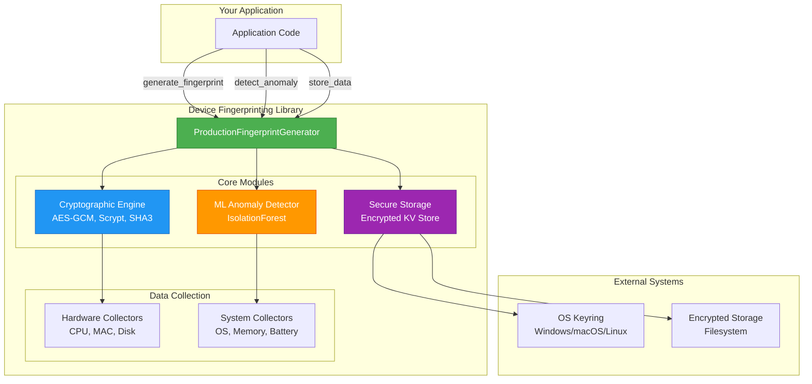
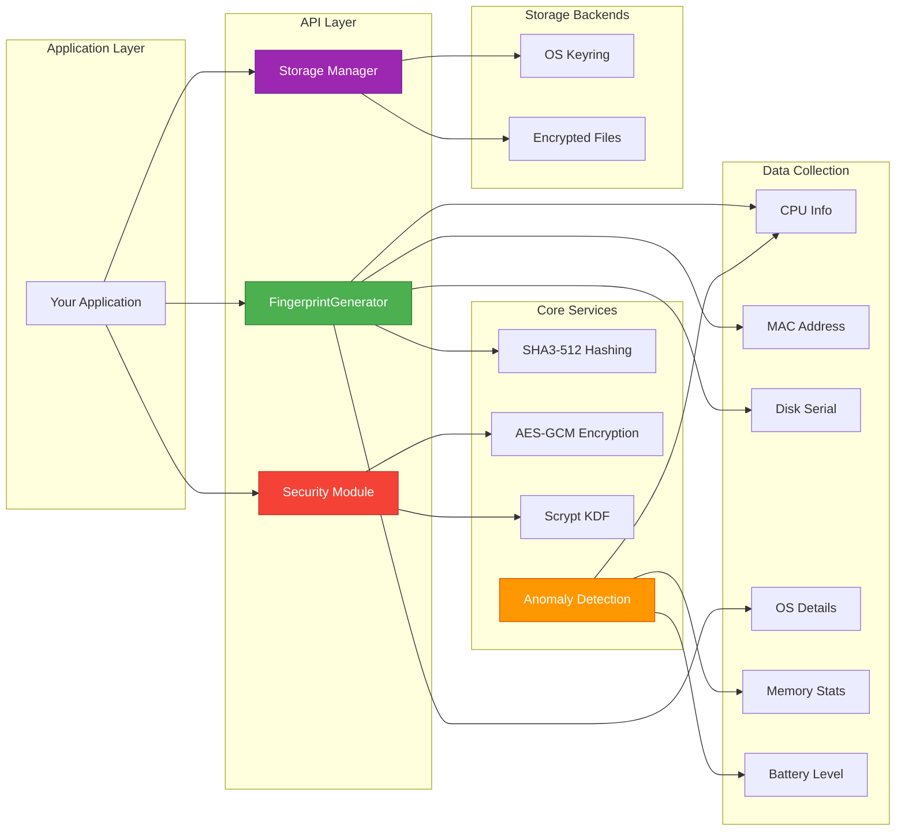
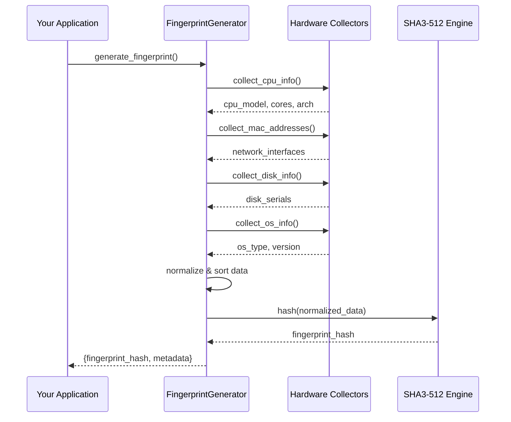
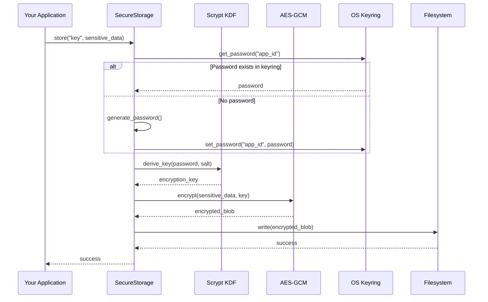
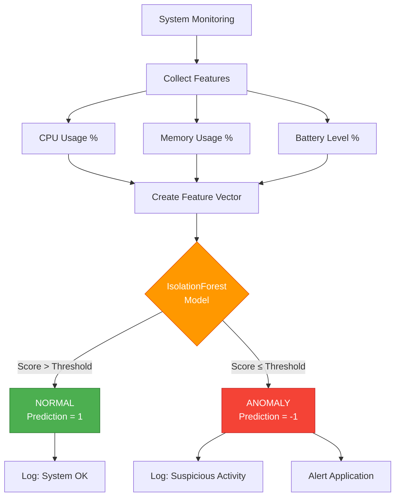
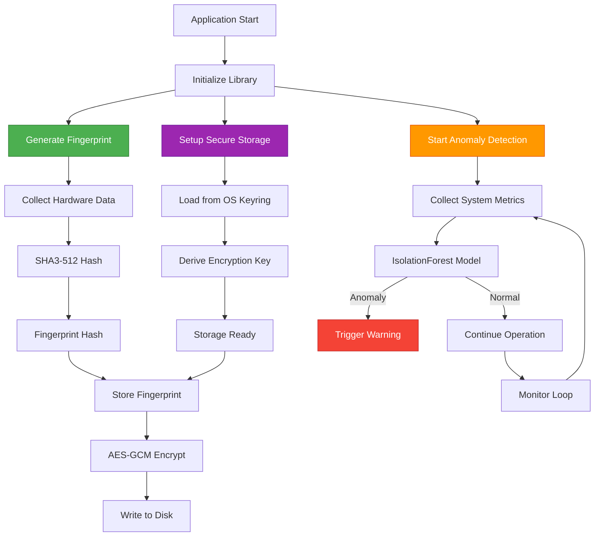

# Device Fingerprinting Library

[](https://www.python.org/downloads/)
[](LICENSE)
[](tests/)

A Python library for hardware-based device fingerprinting with anomaly detection. Generates stable device identifiers from hardware characteristics, provides encrypted storage, and detects anomalous system behavior.

## Table of Contents

- [Overview](#overview)
- [Architecture](#architecture)
- [Features](#features)
- [Installation](#installation)
- [Usage](#usage)
- [Technical Details](#technical-details)
- [Testing](#testing)
- [Dependencies](#dependencies)
- [Contributing](#contributing)
- [License](#license)

## Overview



## Architecture



### Component Diagrams

#### Device Fingerprinting Flow



#### Encryption & Secure Storage Flow



#### ML Anomaly Detection Flow



#### Complete System Data Flow



### Design Principles

**Layered Architecture**
- Application layer provides high-level API
- Service layer implements core logic (fingerprinting, encryption, ML)
- Data layer handles hardware and system data collection

**Component Structure**
- `ProductionFingerprintGenerator`: Primary fingerprinting interface
- `Crypto`: Cryptographic operations (SHA3-512, AES-GCM, Scrypt)
- `MLFeatures`: Anomaly detection using IsolationForest
- `SecureStorage`: Encrypted storage with OS keyring support
- Hardware collectors: Platform-specific data gathering

**Security Implementation**
- AES-GCM encryption for data at rest
- Scrypt KDF for password-based key derivation
- OS keyring integration (Windows, macOS, Linux)
- No plaintext storage of sensitive data

**Extensibility**
- Pluggable backend system
- Optional feature modules (PQC, cloud storage)
- Interface-based design for custom implementations

## Features

**Device Fingerprinting**
- Generates consistent identifiers from hardware attributes (CPU, MAC address, disk serial)
- Uses SHA3-512 hashing for cryptographic fingerprint generation

**Security**
- AES-GCM authenticated encryption for data at rest
- Scrypt key derivation function (memory-hard, brute-force resistant)
- OS keyring integration (Windows Credential Manager, macOS Keychain, Linux Secret Service)

**Anomaly Detection**
- IsolationForest-based detection of abnormal system behavior
- Monitors CPU usage, memory, battery, and network metrics
- Baseline training for environment-specific detection

**Storage**
- Encrypted key-value store
- Cross-platform keyring support
- Secure credential management

**Testing**
- 57 test cases with pytest
- Automated CI/CD pipeline (GitHub Actions)
- Multi-platform support (Windows, macOS, Linux)

**Optional Features**
- Post-quantum cryptography (pqcdualusb with Dilithium/Kyber)
- Cloud storage backends (AWS S3, Azure Blob Storage)

## Installation

### Basic Installation

```bash
# Clone the repository
git clone https://github.com/Johnsonajibi/DeviceFingerprinting.git
cd DeviceFingerprinting/device_fingerprinting

# Install core dependencies
pip install -r requirements.txt

# Install the package in editable mode
pip install -e .
```

### Installation with Optional Features

```bash
# Install with Post-Quantum Cryptography support
pip install -e .[pqc]

# Install with Cloud storage support
pip install -e .[cloud]

# Install with development tools (testing, linting, type checking)
pip install -e .[dev]

# Install all optional features
pip install -e .[pqc,cloud,dev]
```

To verify the installation, run the test suite:

```bash
python -m pytest
```

## Usage

### Basic Fingerprinting

```python
from device_fingerprinting.production_fingerprint import ProductionFingerprintGenerator

# Generate device fingerprint
generator = ProductionFingerprintGenerator()
fingerprint_data = generator.generate_fingerprint()

print(f"Fingerprint: {fingerprint_data['fingerprint_hash']}")
print(f"Platform: {fingerprint_data['system_info']['platform']}")
```

### Anomaly Detection

```python
from device_fingerprinting.ml_features import FeatureExtractor, AnomalyDetector
import numpy as np

# Train detector on baseline data
normal_data = np.random.rand(100, 3)
detector = AnomalyDetector()
detector.train(normal_data)

# Check current system state
feature_extractor = FeatureExtractor()
current_features = feature_extractor.collect_features()
prediction, score = detector.predict(current_features)

if prediction == 1:
    print(f"Normal behavior (score: {score:.2f})")
else:
    print(f"Anomaly detected (score: {score:.2f})")
```

## Technical Details

### Device Fingerprinting

Generates stable device identifiers from hardware characteristics:

**Data Collection:**
1. Hardware: CPU model, cores, architecture, MAC addresses, disk serials
2. System: OS type, version, Python version, hostname
3. Normalization: Consistent ordering for deterministic output
4. Hashing: SHA3-512 for cryptographic fingerprint generation

**Properties:**
- Stable across reboots
- Unique per device
- Deterministic (no randomness)
- Collision-resistant SHA3-512

### Cryptographic Primitives

**Scrypt KDF**
- Memory-hard key derivation
- Password-based encryption key generation
- Resistant to GPU/ASIC attacks
- Configurable cost parameters

**AES-GCM**
- Authenticated encryption (confidentiality + integrity)
- Automatic tamper detection
- NIST-approved algorithm

**SHA3-512**
- Keccak-based hashing
- 512-bit output
- Collision-resistant

### Secure Storage

**Implementation:**
- OS keyring integration (Windows, macOS, Linux)
- AES-GCM encryption at rest
- Key-value interface: `set_item()`, `get_item()`, `delete_item()`
- Automatic encryption/decryption
- Per-instance salt and IV

**Security Model:**
- No plaintext storage
- Memory-hard password protection
- Authenticated encryption (tamper-proof)
- Secure failure modes

### Anomaly Detection

**Detection Targets:**
- Debugging or reverse engineering attempts
- Virtual machine or emulator environments
- Abnormal system load or stress
- System tampering indicators

**Implementation:**
- Real-time system metrics (CPU, memory, battery)
- IsolationForest model trained on baseline behavior
- Deviation scoring from learned baseline
- Binary classification: -1 (anomaly) or 1 (normal)

**Applications:**
- Debugger detection during fingerprint generation
- VM/container environment identification
- System integrity monitoring
- Adaptive security policies

## Testing

### Test Suite
- 57 tests covering core functionality
- 31% code coverage
- Validated modules: `crypto.py`, `security.py`, `secure_storage.py`, `ml_features.py`, `production_fingerprint.py`

### CI/CD Pipeline
GitHub Actions automated testing:
- Platforms: Ubuntu, Windows, macOS
- Python versions: 3.9, 3.10, 3.11, 3.12
- Code quality: flake8, black, mypy
- Security: bandit, safety
- Coverage: Codecov integration

### Running Tests

```bash
# Install dependencies
pip install -r requirements.txt

# Run test suite
python -m pytest

# With coverage report
python -m pytest --cov=device_fingerprinting --cov-report=term-missing
```

## Dependencies

### Core Requirements
- `numpy >= 1.21.0` - Numerical operations
- `scikit-learn >= 1.0.0` - IsolationForest model
- `psutil >= 5.8.0` - System metrics collection
- `cryptography >= 41.0.0` - AES-GCM and Scrypt
- `keyring >= 23.0.0` - OS keyring integration

### Optional Packages
- Post-quantum crypto: `pqcdualusb >= 0.1.4` (install: `pip install -e .[pqc]`)
- Cloud storage: `boto3`, `azure-storage-blob` (install: `pip install -e .[cloud]`)
- Development tools: `pytest`, `black`, `flake8`, `mypy` (install: `pip install -e .[dev]`)

## Contributing

Contributions are welcome. To contribute:

1. Fork the repository
2. Create a feature branch: `git checkout -b feature/your-feature`
3. Make changes and add tests
4. Verify tests pass: `python -m pytest`
5. Submit a pull request

## License

This project is licensed under the MIT License - see the [LICENSE](LICENSE) file for details.
